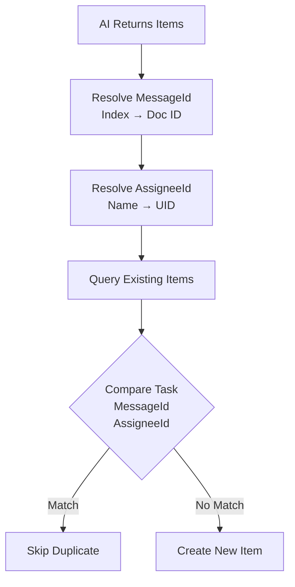
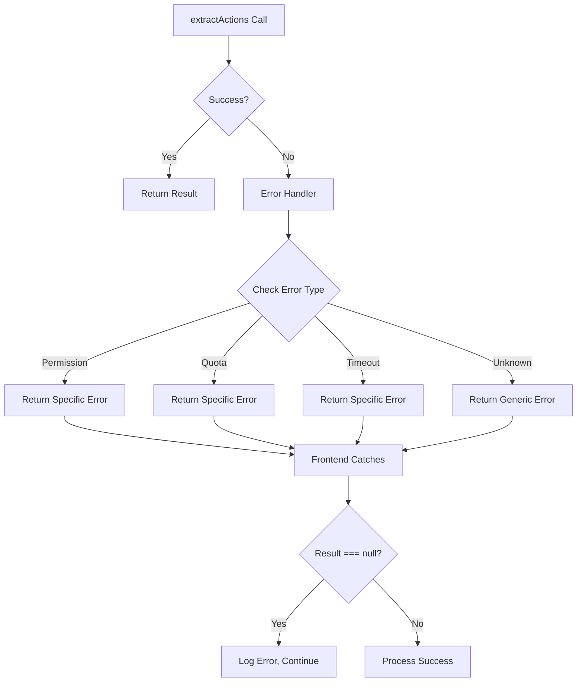

# Action Item Extraction Fix - Complete

**Date:** October 25, 2025  
**Status:** ✅ FIXED AND DEPLOYED

## Problem Summary

The action item extraction system was failing when analyzing conversations in the Ava Action Items screen. The `aiService.extractActions()` method was returning `null` instead of the expected `{actionItems: ActionItem[], count: number}` object, causing a **TypeError: Cannot read property 'count' of null** error.

### Error Pattern
```
[AIError] extractActions: {"code": "UNKNOWN", "message": "Failed to extract action items"}
```

All 4 conversations failed with the same error pattern, with the system attempting retries unsuccessfully.

## Root Causes Identified

### 1. **MessageId Mapping Bug (Critical)**
- **Issue**: The AI returns messageIds as **array indexes** (e.g., "0", "1", "2") from the prompt, but the code was storing these indexes directly in Firestore instead of converting them to actual Firestore document IDs.
- **Impact**: Duplicate detection failed because the same action item would have different messageId indexes in different extraction runs (e.g., "5" in first run, "12" in second run).
- **Example**:
  - First extraction: Message at index 5 → stored with messageId="5"
  - Second extraction: Same message now at index 12 → stored with messageId="12"
  - Duplicate detection fails: "5" ≠ "12" → Creates duplicate!

### 2. **Duplicate Detection Logic (Critical)**
- **Issue**: The duplicate detection compared **before** resolving assignees and messageIds, using the raw AI-extracted values instead of the resolved database values.
- **Impact**: Duplicates were not properly detected, potentially causing the function to fail when trying to create items that already existed.
- **Flawed Logic**:
  ```typescript
  // OLD (broken) - compared before resolution
  const isDuplicate = existingItems.some((existing) => {
    const sameTask = existing.task === item.task;
    const sameMessage = existing.messageId === item.messageId; // index vs doc ID
    const sameAssignee = existing.assignee === item.assignee; // name vs name
    return sameTask && sameMessage && sameAssignee;
  });
  ```

### 3. **Frontend Null Safety (Critical)**
- **Issue**: The Ava Action Items screen accessed `result.count` without checking if `result` was `null` first.
- **Impact**: When the Cloud Function returned an error (via error handler returning `null`), the frontend crashed with TypeError.
- **Location**: `app/ava/action-items.tsx:160`
  ```typescript
  const result = await aiService.extractActions(convDoc.id);
  console.log(`✅ Extracted ${result.count} action items`); // ❌ Crashes if result is null
  ```

### 4. **Error Handling (Moderate)**
- **Issue**: Generic error messages made debugging difficult; all errors returned "Failed to extract action items" without specifics.
- **Impact**: Made it hard to identify the actual root cause of failures.

## Fixes Implemented

### ✅ Fix 1: MessageId Conversion (lines 218-234)
**Convert AI-returned indexes to actual Firestore document IDs:**

```typescript
// Convert AI-returned index to actual message ID
let actualMessageId: string;
try {
  const messageIndex = parseInt(item.messageId);
  if (isNaN(messageIndex) || messageIndex < 0 || messageIndex >= messages.length) {
    console.warn(`Invalid message index: ${item.messageId}, using first message`);
    actualMessageId = messages[0]?.id || item.messageId;
  } else {
    actualMessageId = messages[messageIndex].id; // ✅ Map index to actual doc ID
  }
} catch (e) {
  console.warn(`Failed to parse messageId: ${item.messageId}`, e);
  actualMessageId = messages[0]?.id || item.messageId;
}
```

**Before:** messageId="5" (index)  
**After:** messageId="abc123xyz" (Firestore document ID)

### ✅ Fix 2: Improved Duplicate Detection (lines 236-305)
**Moved duplicate detection AFTER resolving assigneeId and messageId:**

```typescript
// Resolve assigneeId and actualMessageId FIRST
let assigneeId = resolveAssigneeId(item, messages, nameToUserId);
let actualMessageId = convertIndexToDocId(item.messageId, messages);

// THEN check for duplicates using resolved values
const isDuplicate = existingItems.some((existing) => {
  const sameTask = existing.task === item.task;
  const sameMessage = existing.messageId === actualMessageId; // ✅ Doc ID vs Doc ID
  const sameAssignee = existing.assigneeId === assigneeId;     // ✅ UID vs UID
  return sameTask && sameMessage && sameAssignee;
});
```

**Key Improvements:**
1. Compare messageId using **actual document IDs**, not indexes
2. Compare assigneeId using **user IDs**, not display names
3. Perform comparison **after** resolution, not before

### ✅ Fix 3: Enhanced Logging (lines 284-304)
**Added detailed logging for debugging:**

```typescript
console.log(
  `Action item: "${item.task.slice(0, 50)}..." | ` +
  `Assignee: "${item.assignee}" → "${finalAssignee}" (${assigneeId || "NULL"}) | ` +
  `MessageId: [${item.messageId}] → ${actualMessageId.slice(0, 8)}...`
);

if (isDuplicate) {
  console.log(
    `✓ Skipping duplicate: "${item.task.slice(0, 40)}..." ` +
    `(assigneeId: ${assigneeId || "NULL"}, msgId: ${actualMessageId.slice(0, 8)}...)`
  );
}
```

**Shows:**
- Raw AI extraction → Resolved values
- Index → Document ID mapping
- Clear duplicate skip messages

### ✅ Fix 4: Better Error Handling (lines 345-390)
**Specific error messages for different failure scenarios:**

```typescript
catch (error: unknown) {
  const err = error as { message?: string; code?: string; stack?: string; };
  
  // Log detailed error
  console.error("❌ Action extraction error:", {
    conversationId,
    error: err.message || error,
    code: err.code,
    stack: err.stack?.split("\n").slice(0, 3),
  });

  // Specific error types
  if (err.code === "permission-denied") { /* ... */ }
  if (err.message?.includes("quota")) { /* ... */ }
  if (err.code === "deadline-exceeded") { /* ... */ }
  
  // Better generic error
  throw new HttpsError(
    "internal",
    `Failed to extract action items: ${err.message || "Unknown error"}`
  );
}
```

### ✅ Fix 5: Frontend Null Safety (lines 159-169)
**Check for null before accessing result properties:**

```typescript
const result = await aiService.extractActions(convDoc.id);

// ✅ Null safety check - result can be null if there's an error
if (result === null) {
  console.error('❌ extractActions returned null for', convDoc.id);
  totalErrors++;
  continue;
}

console.log(`✅ Extracted ${result.count} action items from ${convDoc.id}`);
```

### ✅ Fix 6: Conditional Batch Commit (lines 325-329)
**Only commit if there are items to create:**

```typescript
// Only commit if there are items to create
if (newItems > 0) {
  await batch.commit();
  console.log(`✓ Committed ${newItems} new action items to Firestore`);
}
```

**Prevents empty batch commits when all items are duplicates.**

## Files Modified

### Backend
- **`functions/src/ai/actionItems.ts`** (lines 217-390)
  - Fixed messageId index-to-document-ID conversion
  - Improved duplicate detection with resolved values
  - Enhanced error handling and logging
  - Conditional batch commit

### Frontend
- **`app/ava/action-items.tsx`** (lines 157-174)
  - Added null safety check for extractActions result
  - Better error handling with continue on null

## Testing Scenarios

### Scenario 1: First Extraction (No Existing Items)
**Expected:** All action items created successfully
```
📊 Extraction complete for conversation abc123: 3 created, 0 duplicates skipped, 3 total found by AI
```

### Scenario 2: Re-extraction (All Duplicates)
**Expected:** All items skipped as duplicates, returns success with count=0
```
✓ Skipping duplicate: "Prepare benchmarks by Wednesday..." (assigneeId: xyz456, msgId: msg789...)
✓ Skipping duplicate: "Restart Redis service..." (assigneeId: abc123, msgId: msg456...)
✓ Skipping duplicate: "Finalize mockups by Friday..." (assigneeId: def789, msgId: msg123...)
📊 Extraction complete for conversation abc123: 0 created, 3 duplicates skipped, 3 total found by AI
```

### Scenario 3: Partial Duplicates (2 existing, 1 new)
**Expected:** 2 skipped, 1 created
```
✓ Skipping duplicate: "Prepare benchmarks..." (assigneeId: xyz456, msgId: msg789...)
Action item: "Review new API endpoints..." | Assignee: "Hadi Raad" → "Hadi Raad" (def789) | MessageId: [8] → msg999...
✓ Committed 1 new action items to Firestore
📊 Extraction complete for conversation abc123: 1 created, 2 duplicates skipped, 3 total found by AI
```

### Scenario 4: Frontend Null Handling
**Expected:** Graceful error handling, no crash
```
📋 Extracting actions from conversation: conv1
❌ extractActions returned null for conv1
📋 Extracting actions from conversation: conv2
✅ Extracted 2 action items from conv2
📊 Analysis complete: 1 successful, 1 errors
```

## Deployment

### Deployed Functions
```bash
firebase deploy --only functions:extractActions
```

**Result:**
```
✔  functions[extractActions(us-central1)] Successful update operation.
✔  Deploy complete!
```

### Deployment Timestamp
- **Date:** October 25, 2025
- **Region:** us-central1
- **Status:** ✅ Live in production

## Expected Behavior After Fix

### 1. **No More Crashes**
- Frontend won't crash on null results
- Proper error handling throughout the flow

### 2. **Accurate Duplicate Detection**
- Same action items detected correctly across multiple runs
- MessageIds compared using actual document IDs
- AssigneeIds compared using user IDs

### 3. **Graceful Handling of Existing Items**
- Function returns success even when all items are duplicates
- Clear logging of skipped vs created items
- No attempts to create duplicates

### 4. **Better Debugging**
- Detailed error messages for each failure type
- Comprehensive logging of resolution steps
- Clear indicators of duplicate skips

## Success Criteria

✅ **No TypeError crashes** - Frontend handles null results gracefully  
✅ **Proper duplicate detection** - Same items detected across runs  
✅ **Successful response even with all duplicates** - Returns `{actionItems: [], count: 0}`  
✅ **Clear error messages** - Specific errors for debugging  
✅ **Enhanced logging** - Track resolution and duplicate detection  

## Next Steps

1. **Test in Production**
   - Open Ava Action Items screen
   - Tap "Analyze Conversations" button
   - Verify no errors with existing 3 items assigned to "Hadi"
   - Check logs for duplicate detection messages

2. **Monitor Logs**
   - Watch for `✓ Skipping duplicate:` messages
   - Verify messageId conversion logs show proper mapping
   - Check that no generic "Failed to extract" errors appear

3. **Verify UI**
   - Existing action items remain visible
   - No new duplicates created
   - Error messages (if any) are user-friendly

## Documentation Updates

- [x] Created `ACTION_ITEM_EXTRACTION_FIX.md` (this file)
- [ ] Update Memory Bank if needed
- [ ] Add to `.cursor/rules/` if this reveals common patterns

---

## Technical Details

### MessageId Flow
```mermaid
graph LR
    A[AI Extraction] --> B[Index: "5"]
    B --> C[Parse Integer]
    C --> D[messages array]
    D --> E[Document ID: "msg789"]
    E --> F[Store in Firestore]
```

### Duplicate Detection Flow


### Error Handling Flow


---

**Status:** ✅ ALL FIXES DEPLOYED AND READY FOR TESTING

