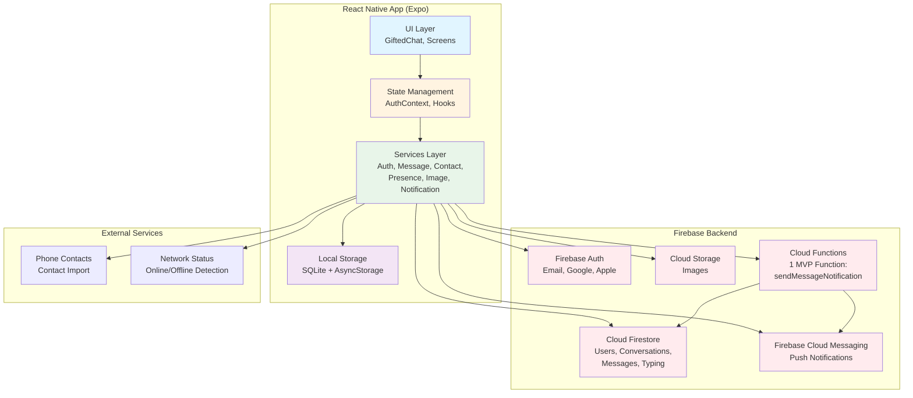
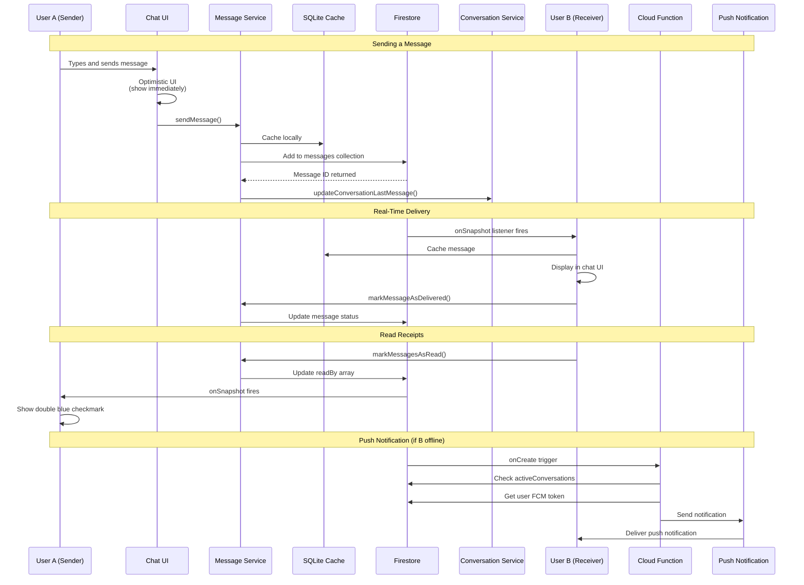
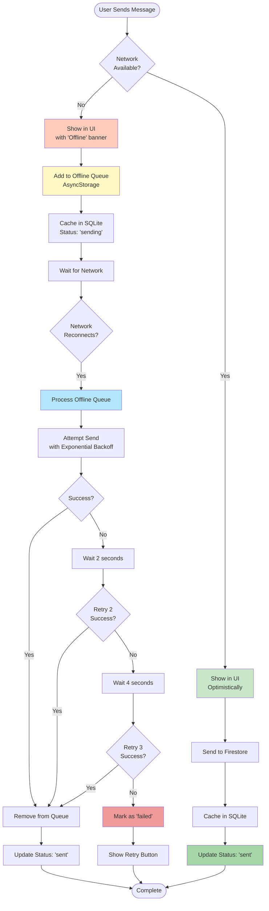
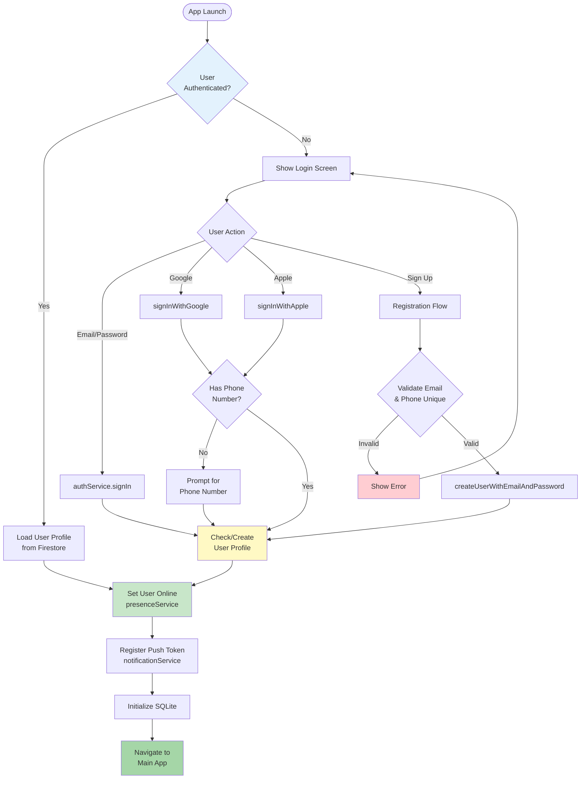
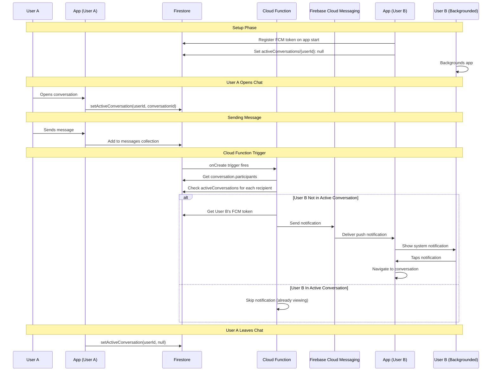
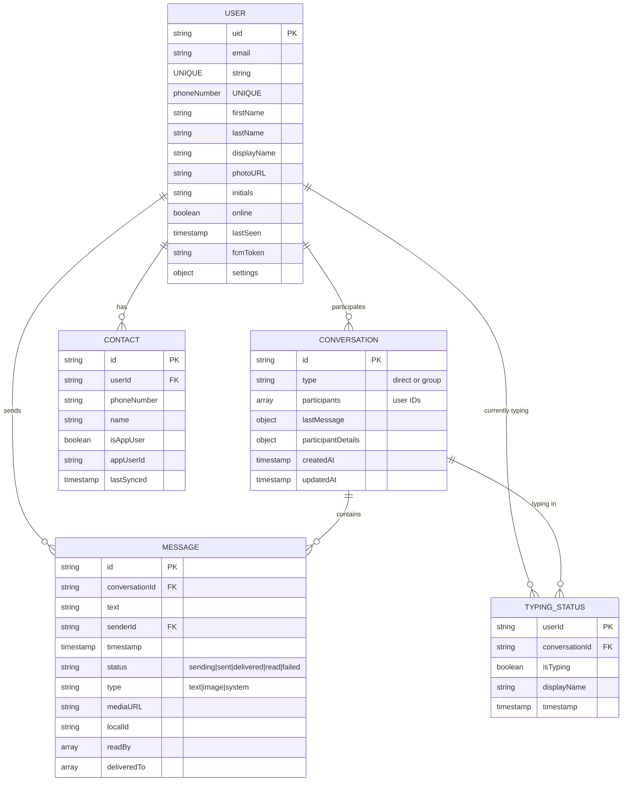
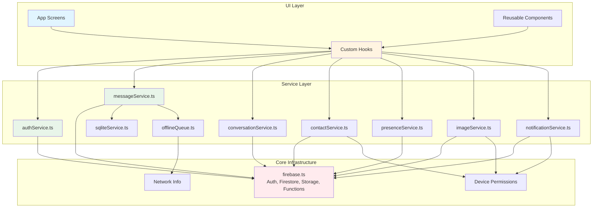

# MVP Architecture Diagrams

## 1. High-Level System Architecture



**Note**: This architecture is for the 24-hour MVP checkpoint only. AI features (which would add additional Cloud Functions and services) are post-MVP and not included in this scope.

---

## 2. Message Flow Architecture



---

## 3. Offline Sync Mechanism



---

## 4. Authentication Flow



---

## 5. Real-Time Features Architecture

```mermaid
graph TB
    subgraph "Chat Screen"
        ChatUI[Chat UI Component]
        TypingHook[useTypingIndicator Hook]
        PresenceHook[usePresence Hook]
        MessagesHook[useMessages Hook]
    end
    
    subgraph "Firestore Real-Time Listeners"
        Messages[conversations/{id}/messages<br/>onSnapshot]
        Typing[conversations/{id}/typing/{userId}<br/>onSnapshot]
        Presence[users/{userId}<br/>onSnapshot]
        ActiveConv[activeConversations/{userId}<br/>setDoc on mount/unmount]
    end
    
    subgraph "Presence Service"
        SetOnline[setUserOnline<br/>+ onDisconnect handler]
        SetOffline[setUserOffline]
        Subscribe[subscribeToUserPresence]
    end
    
    subgraph "User Actions"
        SendMsg[Send Message]
        StartType[Start Typing]
        OpenChat[Open Chat]
        CloseChat[Close Chat]
    end
    
    ChatUI --> MessagesHook
    ChatUI --> TypingHook
    ChatUI --> PresenceHook
    
    MessagesHook --> Messages
    Messages --> |New Message| ChatUI
    
    StartType --> TypingHook
    TypingHook --> |Update isTyping: true| Typing
    TypingHook --> |Auto-clear after 500ms| Typing
    Typing --> |Other user typing| ChatUI
    
    PresenceHook --> Subscribe
    Subscribe --> Presence
    Presence --> |Online/Offline status| ChatUI
    
    OpenChat --> ActiveConv
    CloseChat --> ActiveConv
    
    SendMsg --> Messages
    
    style ChatUI fill:#e1f5ff
    style Messages fill:#ffebee
    style Typing fill:#ffebee
    style Presence fill:#ffebee
    style SetOnline fill:#c8e6c9
```

---

## 6. Push Notification Flow



---

## 7. Data Model Relationships



---

## 8. Service Layer Architecture



---

## 9. File Structure Overview

```mermaid
graph TB
    Root[messaging-app-mvp/]
    
    Root --> App[app/]
    Root --> Components[components/]
    Root --> Services[services/]
    Root --> Hooks[hooks/]
    Root --> Store[store/]
    Root --> Utils[utils/]
    Root --> Types[types/]
    Root --> Functions[functions/]
    
    App --> Auth[auth/<br/>login.tsx<br/>register.tsx]
    App --> Tabs[tabs/<br/>index.tsx<br/>contacts.tsx]
    App --> Chat[chat/<br/>[id].tsx<br/>add-participant.tsx]
    
    Services --> Firebase[firebase.ts]
    Services --> AuthService[authService.ts]
    Services --> MessageService[messageService.ts]
    Services --> ConversationService[conversationService.ts]
    Services --> ContactService[contactService.ts]
    Services --> PresenceService[presenceService.ts]
    Services --> ImageService[imageService.ts]
    Services --> NotificationService[notificationService.ts]
    Services --> SQLiteService[sqliteService.ts]
    Services --> OfflineQueue[offlineQueue.ts]
    
    Hooks --> UseTyping[useTypingIndicator.ts]
    Hooks --> UsePresence[usePresence.ts]
    Hooks --> UseMessages[useMessages.ts]
    
    Store --> AuthContext[AuthContext.tsx]
    
    Types --> Index[index.ts<br/>User, Message, Conversation]
    
    Functions --> CloudFunctions[index.js<br/>sendMessageNotification]
    
    style Root fill:#e3f2fd
    style App fill:#e1f5ff
    style Services fill:#e8f5e9
    style Store fill:#fff4e1
    style Functions fill:#ffebee
```

---

## 10. Critical Path: First Message Flow

```mermaid
flowchart LR
    Start([User Opens App]) --> Auth[Authenticate]
    Auth --> ImportContacts[Import Contacts]
    ImportContacts --> Match[Match Against App Users]
    Match --> ShowList[Show Contact List]
    ShowList --> SelectContact[User Selects Contact]
    SelectContact --> CreateConvo[createOrGetConversation]
    CreateConvo --> NavChat[Navigate to Chat Screen]
    NavChat --> LoadMessages[Load Cached Messages<br/>+ Subscribe to Real-Time]
    LoadMessages --> UserTypes[User Types Message]
    UserTypes --> SendTyping[Update Typing Status]
    UserTypes --> SendMsg[User Sends]
    SendMsg --> OptimisticUI[Show Immediately in UI]
    OptimisticUI --> CheckNet{Network Available?}
    CheckNet -->|Yes| SendFirestore[Send to Firestore]
    CheckNet -->|No| QueueOffline[Queue for Later]
    SendFirestore --> UpdateConvo[Update Conversation LastMessage]
    UpdateConvo --> Cache[Cache in SQLite]
    Cache --> Recipient[Recipient's onSnapshot Fires]
    Recipient --> ShowRecipient[Show on Recipient's Device]
    ShowRecipient --> MarkDelivered[Mark as Delivered]
    MarkDelivered --> End([Message Delivered])
    
    style Start fill:#c8e6c9
    style Auth fill:#fff9c4
    style SendMsg fill:#e1f5ff
    style OptimisticUI fill:#a5d6a7
    style End fill:#81c784
```



---

## Usage Instructions

### For Cursor/Claude Code:

1. **Save these diagrams** in your repository as `docs/ARCHITECTURE.md`
2. **Reference in README.md**: Link to architecture docs so AI sees them
3. **When asking Cursor for help**, mention: "See docs/ARCHITECTURE.md for system design"
4. **During code generation**, Cursor will understand how components connect

### For Development:

1. **Onboarding**: Review diagrams before starting each phase
2. **Debugging**: Trace issues through sequence diagrams
3. **Feature Planning**: Use architecture to identify integration points
4. **Code Review**: Verify new code follows architectural patterns

### Viewing in GitHub:

These Mermaid diagrams render automatically in GitHub's Markdown viewer. You can also:
- Use Mermaid Live Editor: https://mermaid.live
- Install Mermaid Preview extension in VS Code/Cursor
- View in GitHub README or wiki pages

---

## Key Architectural Principles

1. **Services Layer Isolation**: All Firebase/external interactions go through services
2. **Offline-First**: SQLite cache + AsyncStorage queue ensures resilience
3. **Real-Time by Default**: Firestore onSnapshot listeners for live updates
4. **Optimistic UI**: Show changes immediately, sync in background
5. **Smart Notifications**: Cloud Functions check active conversations before sending
6. **Type Safety**: TypeScript interfaces define all data structures
7. **Testability**: Services can be mocked, hooks can be tested in isolation
8. **Uniqueness Enforcement**: Email/phone uniqueness via Firestore security rules with index collections
9. **Emulator Support**: Firebase emulators for integration testing without hitting production

---

## MVP Scope Notes

**This architecture document focuses on the 24-hour MVP checkpoint** which includes:
- ✅ Complete messaging infrastructure (all 10 MVP features)
- ✅ Real-time sync with offline support
- ✅ Push notifications via Expo Go
- ✅ 1 Cloud Function for notifications
- ✅ Testing on iOS and Android simulators

**Post-MVP (Beyond 24-Hour Checkpoint):**
- AI features with additional Cloud Functions
- RAG pipelines and LLM integration
- Advanced capabilities (multi-step agents, proactive assistants)
- Production builds (TestFlight, APK)

The messaging foundation is production-ready and can scale to support AI features when needed.

---

## Testing Strategy for MVP

### Integration Testing with Firebase Emulator
```bash
# Start emulators
firebase emulators:start

# Run integration tests
npm test -- --testPathPattern=integration

# Tests connect to:
# - Auth Emulator: localhost:9099
# - Firestore Emulator: localhost:8080
# - Functions Emulator: localhost:5001
```

### Push Notification Testing with Expo Go
- Install Expo Go on iOS Simulator and Android Emulator
- Run `npm start` and scan QR code with Expo Go
- Expo Go supports push notifications in development mode
- No physical devices required for MVP testing
- Background app and send message to receive notification

### End-to-End Testing
All 7 MVP test scenarios can be completed on:
- iOS Simulator + Android Emulator (running Expo Go)
- No physical devices required
- Firebase Emulator for backend testing
- Production Firebase for full integration testing

---

**These diagrams are living documents - update them as your architecture evolves!**